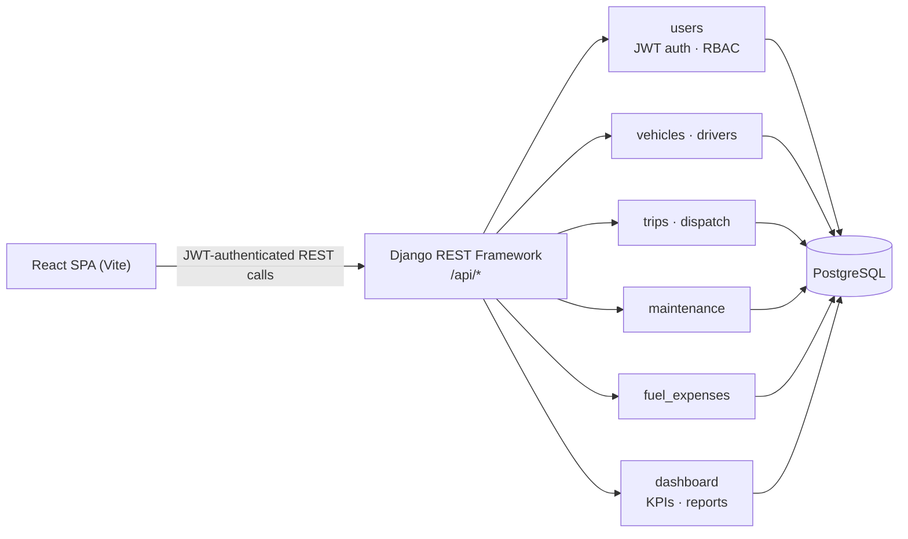
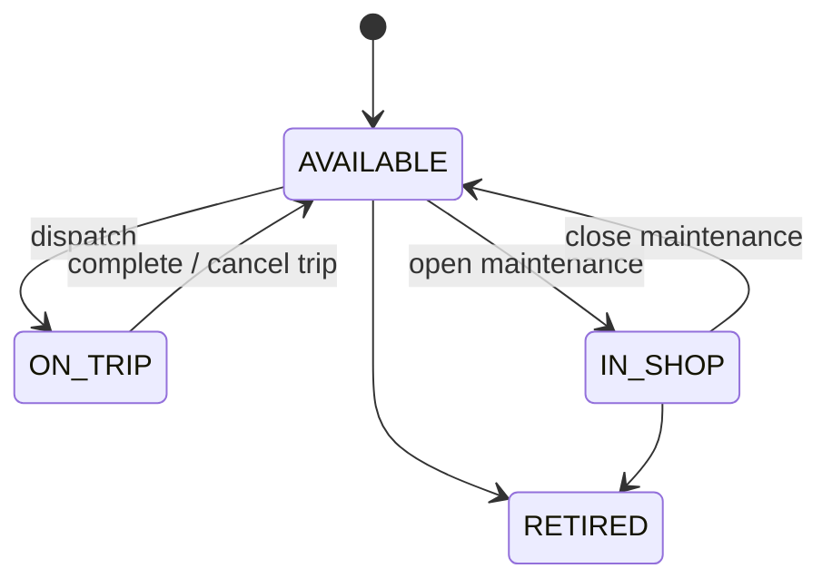
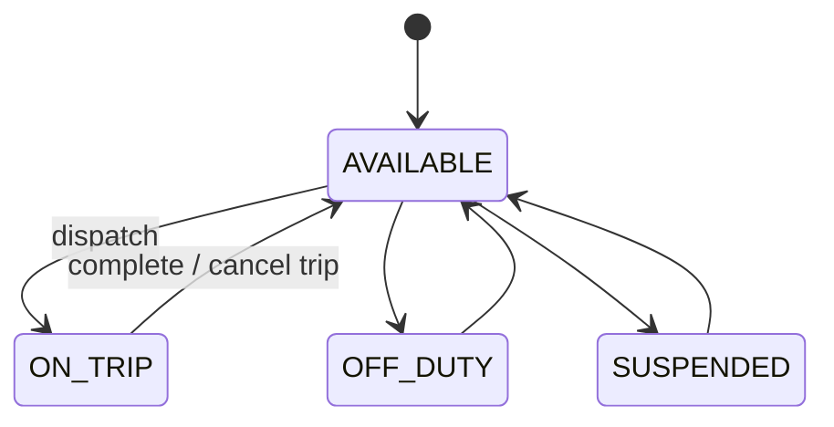
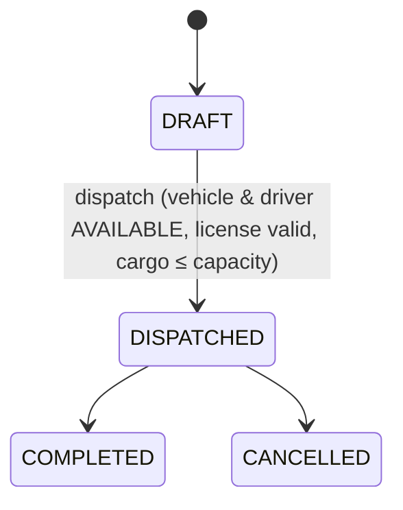

<div align="center">

# 🚛 TransitOps
### Smart Transport Operations Platform

Fleet management, trip dispatch, maintenance workflow, fuel & expense tracking, and live KPIs — in one platform.

[](https://www.djangoproject.com/)
[](https://www.django-rest-framework.org/)
[](https://react.dev/)
[](https://vitejs.dev/)
[](https://www.postgresql.org/)
[](https://render.com/)

**[▶️ Watch the explainer video](https://drive.google.com/drive/folders/1Msvl1N18EIOVItwrzmpiBduejQ7v5fLg?usp=drive_link)**

</div>

---

## Contents

- [Overview](#overview)
- [Architecture](#architecture)
- [Domain workflows](#domain-workflows)
- [Repository layout](#repository-layout)
- [Getting started](#getting-started)
- [Running tests](#running-tests)
- [Roles (RBAC)](#roles-rbac)
- [API surface](#api-surface)

## Overview

| Layer | Tech |
|---|---|
| Backend | Django 5.2, Django REST Framework, SimpleJWT, django-filter |
| Database | PostgreSQL (SQLite supported for local-only convenience — see caveat below) |
| Frontend | React 19, Vite, React Router |
| Deploy | Render (`render.yaml`) |

## Architecture



## Domain workflows

**Vehicle status**



**Driver status**



**Trip status**



Rules enforced by the [dispatch](dispatch/) service:

- Dispatch requires: trip is `DRAFT`, vehicle `AVAILABLE`, driver `AVAILABLE` with a non-expired license, and `cargo_weight ≤ vehicle.capacity`
- Opening maintenance moves the vehicle to `IN_SHOP` and is blocked while the vehicle is `ON_TRIP`; closing it restores `AVAILABLE` unless the vehicle has since been retired
- Completing/cancelling a trip releases the vehicle/driver back to `AVAILABLE` only if they're still `ON_TRIP` — this never clobbers a status another workflow (e.g. maintenance) has since set

## Repository layout

```
transitops/        project settings, root URLs, exception handling
users/              custom User model, JWT auth, RBAC (HasRole permission)
vehicles/           Vehicle CRUD, status lifecycle
drivers/            Driver CRUD, license expiry checks
trips/              Trip CRUD (draft/complete/cancel), capacity validation
dispatch/           dispatch_trip service — the concurrency-safe status-transition engine
maintenance/        Maintenance log workflow (open/close, vehicle status side effects)
fuel_expenses/      Fuel logs and expense tracking
dashboard/          KPIs, operational cost reports, CSV export
frontend/           React SPA (src/pages, src/api, src/components, src/context)
```

Each Django app owns its own `models.py`, `serializers.py`, `views.py`, `urls.py`, and `tests.py`.

## Getting started

### Backend

```bash
python -m venv .venv
source .venv/Scripts/activate   # .venv/bin/activate on macOS/Linux
pip install -r requirements.txt
cp .env.example .env            # fill in DB credentials
python manage.py migrate
python manage.py runserver
```

> **Database note:** the shared default is Postgres. `select_for_update()` (used to serialize concurrent dispatch/complete/cancel requests) silently no-ops on SQLite, which would make the dispatch concurrency tests pass falsely. Set `DB_ENGINE=sqlite` in your own `.env` only as a personal convenience for day-to-day work — never rely on it when touching `dispatch/` or `trips/services.py`.

### Frontend

```bash
cd frontend
npm install
cp .env.example .env   # VITE_API_BASE_URL, VITE_USE_MOCKS
npm run dev
```

Set `VITE_USE_MOCKS=false` once the backend is running locally to hit the real API instead of the built-in mock data layer (`src/api/mockData.js`).

## Running tests

```bash
python manage.py test
```

Runs the full Django/DRF test suite across all apps (auth, RBAC, CRUD, trip validation, dispatch concurrency, maintenance workflow, fuel/expense tracking, dashboard KPIs). The two `dispatch.tests` concurrency tests require a real Postgres connection — expect them to fail under `DB_ENGINE=sqlite`.

The frontend has no automated test suite configured yet.

## Roles (RBAC)

Enforced per-endpoint via `users/permissions.py::HasRole`.

| Resource | Fleet Manager | Driver | Safety Officer | Financial Analyst |
|---|---|---|---|---|
| Vehicles | read/write | — | — | — |
| Drivers | write | — | read | — |
| Maintenance | write | — | read | — |
| Fuel & Expenses | write | — | — | read |
| Trips / Dispatch | authenticated only — no role restriction (open question, not an oversight — the PRD doesn't specify one) | | | |

## API surface

All endpoints are namespaced under `/api/`:

| Endpoint | Purpose |
|---|---|
| `/api/auth/` | register, login, me |
| `/api/vehicles/`, `/api/drivers/` | CRUD |
| `/api/trips/`, `/api/dispatch/<id>/` | trip lifecycle |
| `/api/maintenance/` | maintenance log workflow |
| `/api/fuel-logs/`, `/api/expenses/` | fuel & expense tracking |
| `/api/dashboard/kpis/`, `/api/reports/operational-costs/`, `/api/reports/csv/` | analytics |
